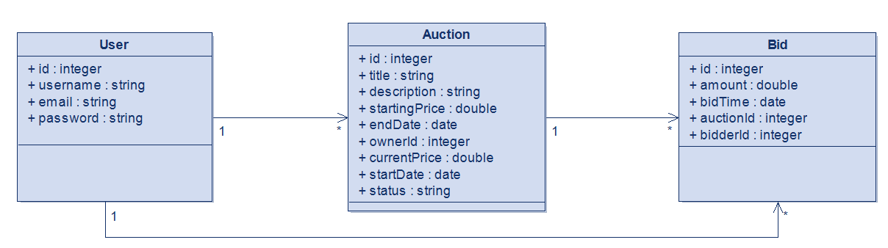

# 🏷️ System Aukcyjny — Projekt_Aukcje

Pełnostackowa aplikacja aukcyjna zbudowana w **ASP.NET Core 10** (backend) i **Angular** (frontend). Umożliwia rejestrację użytkowników, wystawianie aukcji, licytowanie i zarządzanie własnym kontem.

---

## 📋 Spis treści

- [Wymagania wstępne](#wymagania-wstępne)
- [Szybki start (Docker)](#szybki-start-docker)
- [Uruchomienie lokalne (bez Dockera)](#uruchomienie-lokalne-bez-dockera)
- [Domyślne dane testowe](#domyślne-dane-testowe)
- [Dokumentacja API](#dokumentacja-api)
  - [Użytkownicy](#użytkownicy)
  - [Aukcje](#aukcje)
  - [Oferty](#oferty)
- [Statusy aukcji](#statusy-aukcji)
- [Kody odpowiedzi HTTP](#kody-odpowiedzi-http)
- [Uruchomienie testów](#uruchomienie-testów)

---

## Wymagania wstępne

### Docker (zalecane)

| Narzędzie | Minimalna wersja |
|-----------|-----------------|
| Docker    | 24.x            |
| Docker Compose | v2.x       |

### Bez Dockera

| Narzędzie | Minimalna wersja |
|-----------|-----------------|
| .NET SDK  | 10.0            |
| Node.js   | 22.x            |
| npm       | 10.x            |

---

## Szybki start (Docker)

```bash
# 1. Sklonuj repozytorium
git clone https://github.com/MlodyJano/Projekt_Aukcje.git
cd Projekt_Aukcje

# 2. Uruchom cały stack (API + frontend)
docker compose up --build

# 3. Aplikacja dostępna pod:
#    Frontend:  http://localhost:4200
#    API:       http://localhost:8080
#    Swagger:   http://localhost:8080/scalar  (tylko Development)
```

Zatrzymanie:
```bash
docker compose down          # Zatrzymuje kontenery, zachowuje dane
docker compose down -v       # Zatrzymuje i usuwa wolumeny (baza danych!)
```

---

## Uruchomienie lokalne (bez Dockera)

### Backend

```bash
cd Backend/AuctionSystem.API/AuctionSystem.API

# Przywróć zależności
dotnet restore

# Uruchom (HTTP: 5000, HTTPS: 7000)
dotnet run

# Interaktywna dokumentacja API:
# http://localhost:5000/scalar
```

### Frontend

```bash
cd auction-frontend

# Zainstaluj zależności
npm install

# Uruchom serwer deweloperski (proxy → localhost:5000)
ng serve

# Aplikacja dostępna pod http://localhost:4200
```

---

## Domyślne dane testowe

Po pierwszym uruchomieniu baza jest automatycznie seedowana:

| Dane        | Wartość          |
|-------------|-----------------|
| Login        | `admin`         |
| Hasło        | `admin123`      |
| Email        | `admin@auction.pl` |

Dostępne są również dwie przykładowe aukcje (Smartfon testowy, Książka programistyczna).

---

## Diagram bazy danych (ERD)

Struktura relacyjna trwałego przechowywania danych systemu aukcyjnego (SQLite), obrazująca powiązania między encjami User, Auction oraz Bid.




## Dokumentacja API

Bazowy URL: `http://localhost:8080` (Docker) lub `http://localhost:5000` (lokalne).

> Pełna specyfikacja OpenAPI dostępna jako plik `openapi.yaml` lub interaktywnie pod `/scalar`.

---

### Użytkownicy

#### `GET /api/users` — Lista użytkowników

Zwraca wszystkich zarejestrowanych użytkowników.

**Odpowiedź 200:**
```json
[
  {
    "id": 1,
    "username": "admin",
    "email": "admin@auction.pl",
    "createdAt": "2026-06-11T19:51:00Z"
  }
]
```

---

#### `GET /api/users/{id}` — Pobierz użytkownika

| Parametr | Typ   | Opis      |
|----------|-------|-----------|
| `id`     | `int` | ID użytkownika (ścieżka) |

**Odpowiedź 200:** obiekt `UserDto`
**Odpowiedź 404:** `{ "message": "Użytkownik nie istnieje." }`

---

#### `POST /api/users` — Rejestracja

```json
// Ciało żądania
{
  "username": "jan_kowalski",   // 3–20 znaków
  "email": "jan@example.com",
  "password": "tajneHaslo123"  // min. 6 znaków
}
```

**Odpowiedź 200:** dane nowego użytkownika (`UserDto`)
**Odpowiedź 400:** `{ "message": "Nazwa użytkownika jest już zajęta." }`

---

#### `POST /api/users/login` — Logowanie

```json
{
  "username": "admin",
  "password": "admin123"
}
```

**Odpowiedź 200:** `UserDto` — klient przechowuje `id` do kolejnych żądań
**Odpowiedź 401:** `{ "message": "Nieprawidłowy login lub hasło." }`

> ⚠️ API nie używa JWT. Tożsamość użytkownika jest przekazywana jako `ownerId`/`bidderId` w ciele żądań.

---

#### `PUT /api/users/{id}` — Aktualizacja danych

Przyjmuje ten sam schemat co rejestracja. Odpowiedź: `204 No Content` lub `404`.

---

#### `DELETE /api/users/{id}` — Usuń konto

**Odpowiedź 204:** konto usunięte
**Odpowiedź 409:** `{ "message": "Nie można usunąć konta, ponieważ masz aktywne aukcje lub złożone oferty." }`

---

### Aukcje

#### `GET /api/auctions` — Lista aukcji

| Parametr   | Typ      | Wymagany | Opis |
|------------|----------|----------|------|
| `category` | `string` | Nie      | Filtr po kategorii (np. `Elektronika`, `Sport`) |
| `status`   | `string` | Nie      | Filtr po statusie: `Active`, `Ended`, `Cancelled` |

**Odpowiedź 200:**
```json
[
  {
    "id": 1,
    "title": "Smartfon Samsung",
    "description": "Stan idealny",
    "category": "Elektronika",
    "startingPrice": 1500.00,
    "currentPrice": 1750.00,
    "startDate": "2026-06-10T10:00:00Z",
    "endDate": "2026-06-20T10:00:00Z",
    "status": "Active",
    "ownerId": 1,
    "ownerUsername": "admin",
    "imagePath": "/uploads/1_abc.jpg"
  }
]
```

---

#### `GET /api/auctions/{id}` — Szczegóły aukcji

**Odpowiedź 200:** `AuctionDto`
**Odpowiedź 404:** `{ "message": "Aukcja o ID 99 nie istnieje." }`

---

#### `POST /api/auctions` — Utwórz aukcję

```json
{
  "title": "Rower Trek",          // 3–100 znaków
  "description": "Nowy, rocznik 2023",
  "category": "Sport",
  "startingPrice": 2500.00,       // > 0
  "endDate": "2026-07-01T18:00:00Z",
  "ownerId": 1
}
```

**Odpowiedź 201:** `AuctionDto` + nagłówek `Location: /api/auctions/42`

---

#### `POST /api/auctions/{id}/image` — Prześlij zdjęcie

Żądanie `multipart/form-data` z polem `file` (JPEG, PNG lub WebP).

**Odpowiedź 200:**
```json
{ "imagePath": "/uploads/1_d3a1b2c4.jpg" }
```

---

#### `PUT /api/auctions/{id}` — Zaktualizuj aukcję

Przyjmuje ten sam schemat co tworzenie. Odpowiedź: `204 No Content`.

---

#### `PUT /api/auctions/{id}/cancel` — Anuluj aukcję

```json
{ "ownerId": 1 }
```

**Odpowiedź 200:** `{ "message": "Aukcja została anulowana." }`
**Odpowiedź 400:** błąd (nie właściciel / aukcja nie jest Active)

---

#### `DELETE /api/auctions/{id}` — Usuń aukcję

**Odpowiedź 204:** aukcja usunięta
**Odpowiedź 404:** aukcja nie istnieje

---

### Oferty

#### `GET /api/auctions/{auctionId}/bids` — Oferty aukcji

Zwraca wszystkie oferty dla danej aukcji.

**Odpowiedź 200:**
```json
[
  {
    "id": 10,
    "amount": 1800.00,
    "bidTime": "2026-06-12T14:23:00Z",
    "bidderId": 2,
    "bidderUsername": "marta_nowak",
    "auctionId": 1,
    "auctionTitle": "",
    "auctionCategory": "",
    "auctionImagePath": null
  }
]
```

---

#### `POST /api/auctions/{auctionId}/bids` — Złóż ofertę

```json
{
  "amount": 1900.00,   // Musi być wyższe niż currentPrice
  "bidderId": 2        // Nie może być właścicielem aukcji
}
```

**Odpowiedź 200:** `{ "message": "Oferta została złożona pomyślnie!" }`
**Odpowiedź 400:** komunikat błędu (za niska kwota / własna aukcja / aukcja zakończona)

---

#### `GET /api/users/{userId}/bids` — Oferty użytkownika

Zwraca wszystkie oferty złożone przez danego użytkownika wraz z danymi aukcji.

---

## Statusy aukcji

| Status      | Opis                                                  |
|-------------|-------------------------------------------------------|
| `Active`    | Aukcja trwa, można składać oferty                     |
| `Ended`     | Czas aukcji upłynął (ustawiany automatycznie)         |
| `Cancelled` | Aukcja anulowana przez właściciela przed zakończeniem |

> Przejście `Active → Ended` następuje automatycznie przy każdym odczycie aukcji, jeśli `endDate < DateTime.Now`.

---

## Kody odpowiedzi HTTP

| Kod | Znaczenie                                |
|-----|------------------------------------------|
| 200 | Sukces (z treścią odpowiedzi)            |
| 201 | Zasób utworzony                          |
| 204 | Sukces (bez treści odpowiedzi)           |
| 400 | Błąd walidacji lub błąd biznesowy        |
| 401 | Nieprawidłowe dane logowania             |
| 404 | Zasób nie istnieje                       |
| 409 | Konflikt (np. użytkownik ma aukcje)      |
| 500 | Wewnętrzny błąd serwera                  |

---

## Uruchomienie testów

Framework: **xUnit** + **Moq** + **FluentAssertions**

```bash
# 1. Utwórz projekt testowy (jednorazowo)
dotnet new xunit -n AuctionSystem.API.Tests
cd AuctionSystem.API.Tests

# 2. Dodaj referencję do projektu głównego
dotnet add reference ../Backend/AuctionSystem.API/AuctionSystem.API/AuctionSystem.API.csproj

# 3. Zainstaluj zależności testowe
dotnet add package Moq
dotnet add package FluentAssertions
dotnet add package BCrypt.Net-Next

# 4. Skopiuj plik AuctionSystem.Tests.cs do katalogu projektu testowego

# 5. Uruchom testy
dotnet test

# 6. Uruchom z raportem pokrycia (wymaga coverlet)
dotnet add package coverlet.collector
dotnet test --collect:"XPlat Code Coverage"
```

Testy pokrywają:

- `AuctionService` — pobieranie, tworzenie, anulowanie, usuwanie, automatyczny `Ended`, sortowanie
- `BidService` — składanie ofert (all business rules), pobieranie ofert
- `UserService` — rejestracja, logowanie, case-insensitivity, haszowanie hasła, usuwanie
- Edge cases — puste kolekcje, filtrowanie statusów

---

## 🗂️ Struktura projektu

```
Projekt_Aukcje/
├── Backend/
│   └── AuctionSystem.API/
│       └── AuctionSystem.API/
│           ├── Controllers/     # Endpointy REST
│           ├── Services/        # Logika biznesowa
│           ├── Repositories/    # Dostęp do bazy danych
│           ├── Models/          # Encje EF Core
│           ├── DTOs/            # Obiekty transferu danych
│           ├── Data/            # DbContext (SQLite)
│           └── Program.cs       # Punkt wejścia + konfiguracja DI
└── auction-frontend/            # Angular 17+ SPA
    └── src/app/
        ├── components/          # Strony (login, register, aukcje)
        ├── core/services/       # Serwisy HTTP Angular
        └── shared/models/       # Typy TypeScript
```

---

## 🔧 Technologie

| Warstwa  | Technologia                          |
|----------|--------------------------------------|
| Backend  | ASP.NET Core 10, EF Core 10, SQLite  |
| Frontend | Angular 17+, TypeScript              |
| Auth     | BCrypt.Net-Next (haszowanie haseł)   |
| API Docs | Scalar + OpenAPI (Swashbuckle)       |
| Testy    | xUnit, Moq, FluentAssertions         |
| Docker   | Multi-stage builds, Nginx            |
